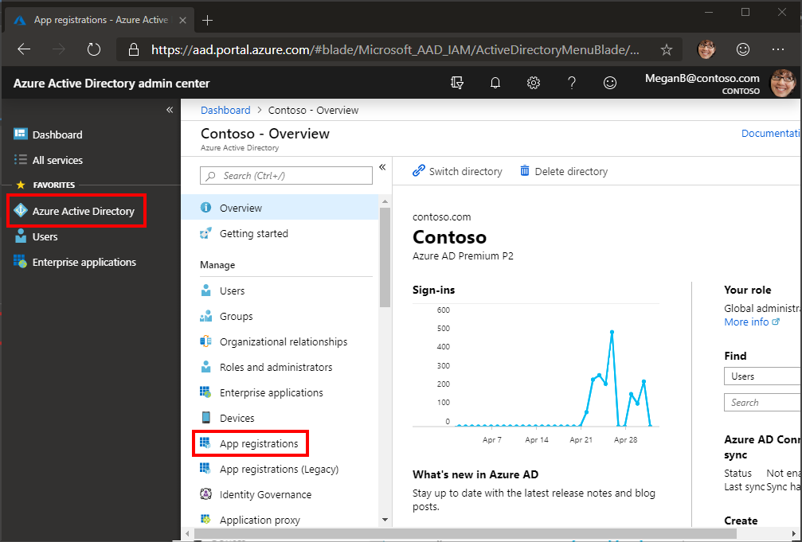

# Vorgehensweise Ausführen des abgeschlossenen ProjektsHow to run the completed project

## VoraussetzungenPrerequisites

Um das abgeschlossene Projekt in diesem Ordner auszuführen, benötigen Sie Folgendes:To run the completed project in this folder, you need the following:

- [Android Studio](https://developer.android.com/studio/) auf dem Entwicklungscomputer installiert.[Android Studio](https://developer.android.com/studio/) installed on your development machine. (**Hinweis:** dieses Lernprogramm wurde mit der Version 3.3.1 von Android Studio mit dem 1.8.0 JRE und dem Android 9,0 SDK geschrieben.(**Note:** This tutorial was written with Android Studio version 3.3.1 with the 1.8.0 JRE and the Android 9.0 SDK. Die Schritte in diesem Leitfaden funktionieren möglicherweise mit anderen Versionen, aber das wurde nicht getestet.)The steps in this guide may work with other versions, but that has not been tested.)
- Entweder ein persönliches Microsoft-Konto mit einem Postfach auf Outlook.com oder ein Microsoft-Arbeits-oder Schulkonto.Either a personal Microsoft account with a mailbox on Outlook.com, or a Microsoft work or school account.

Wenn Sie kein Microsoft-Konto haben, gibt es mehrere Optionen, um ein kostenloses Konto zu erhalten:If you don't have a Microsoft account, there are a couple of options to get a free account:

- Sie können [sich für ein neues persönliches Microsoft-Konto registrieren](https://signup.live.com/signup?wa=wsignin1.0&rpsnv=12&ct=1454618383&rver=6.4.6456.0&wp=MBI_SSL_SHARED&wreply=https://mail.live.com/default.aspx&id=64855&cbcxt=mai&bk=1454618383&uiflavor=web&uaid=b213a65b4fdc484382b6622b3ecaa547&mkt=E-US&lc=1033&lic=1).You can [sign up for a new personal Microsoft account](https://signup.live.com/signup?wa=wsignin1.0&rpsnv=12&ct=1454618383&rver=6.4.6456.0&wp=MBI_SSL_SHARED&wreply=https://mail.live.com/default.aspx&id=64855&cbcxt=mai&bk=1454618383&uiflavor=web&uaid=b213a65b4fdc484382b6622b3ecaa547&mkt=E-US&lc=1033&lic=1).
- Sie können sich [für das Office 365 Entwicklerprogramm registrieren](https://developer.microsoft.com/office/dev-program) , um ein kostenloses Office 365-Abonnement zu erhalten.You can [sign up for the Office 365 Developer Program](https://developer.microsoft.com/office/dev-program) to get a free Office 365 subscription.

## Registrieren einer Anwendung im Azure-PortalRegister an application with the Azure Portal

1. Öffnen Sie einen Browser, und navigieren Sie zum [Azure Active Directory Admin Center](https://aad.portal.azure.com). Melden Sie sich mit einem **persönlichen Konto** (auch: Microsoft-Konto) oder einem **Geschäfts- oder Schulkonto** an.Open a browser and navigate to the [Azure Active Directory admin center](https://aad.portal.azure.com) and login using a **personal account** (aka: Microsoft Account) or **Work or School Account**.

1. Wählen Sie in der linken Navigationsleiste **Azure Active Directory** aus, und wählen Sie dann **App-Registrierungen** unter **Manage**aus.Select **Azure Active Directory** in the left-hand navigation, then select **App registrations** under **Manage**.

    

1. Wählen Sie **Neue Registrierung** aus.Select **New registration**. Legen Sie auf der Seite **Anwendung registrieren** die Werte wie folgt fest.On the **Register an application** page, set the values as follows.

    - Legen Sie **Name** auf `Android Graph Tutorial` fest.Set **Name** to `Android Graph Tutorial`.
    - Legen Sie **Unterstützte Kontotypen** auf **Konten in allen Organisationsverzeichnissen und persönliche Microsoft-Konten** fest.Set **Supported account types** to **Accounts in any organizational directory and personal Microsoft accounts**.
    - Lassen Sie **URI umleiten** leer.Leave **Redirect URI** empty.

    

1. Wählen Sie **registrieren**aus.Select **Register**. Kopieren Sie auf der Seite **Xamarin Graph Tutorial** den Wert der **Anwendungs-ID (Client)** , und speichern Sie ihn, die Sie im nächsten Schritt benötigen.On the **Xamarin Graph Tutorial** page, copy the value of the **Application (client) ID** and save it, you will need it in the next step.

    

1. Klicken Sie auf den Link **Umleitungs-URI hinzufügen** .Select the **Add a Redirect URI** link. Suchen Sie auf der Seite " **Umleitungs-URIs** " den Abschnitt **vorgeschlagene Umleitungs-URIs für öffentliche Clients (Mobile, Desktop)** .On the **Redirect URIs** page, locate the **Suggested Redirect URIs for public clients (mobile, desktop)** section. Wählen Sie den URI aus, `msal` der mit beginnt, und kopieren Sie ihn, und wählen Sie dann **Speichern**aus.Select the URI that begins with `msal` and copy it, then select **Save**. Speichern Sie den kopierten Umleitungs-URI, den Sie im nächsten Schritt benötigen.Save the copied redirect URI, you will need it in the next step.

    

## Konfigurieren des BeispielsConfigure the sample

1. Benennen Sie `oauth_strings.xml.example` die Datei `oauth_strings.xml` in die Datei um, und `GraphTutorial/app/src/main/res/values` legen Sie Sie in das Verzeichnis ab.Rename the `oauth_strings.xml.example` file to `oauth_strings.xml` and move the file into the `GraphTutorial/app/src/main/res/values` directory.
1. Bearbeiten Sie `oauth_strings.xml` die Datei, und nehmen Sie die folgenden Änderungen vor.Edit the `oauth_strings.xml` file and make the following changes.
    1. Ersetzen `YOUR_APP_ID_HERE` Sie durch die **Anwendungs-ID** , die Sie aus dem Azure-Portal erhalten haben.Replace `YOUR_APP_ID_HERE` with the **Application Id** you got from the Azure portal.

## Ausführen des BeispielsRun the sample

Wählen Sie in Android Studio im Menü **Ausführen** die Option **app ausführen** aus.In Android Studio, select **Run 'app'** on the **Run** menu.
