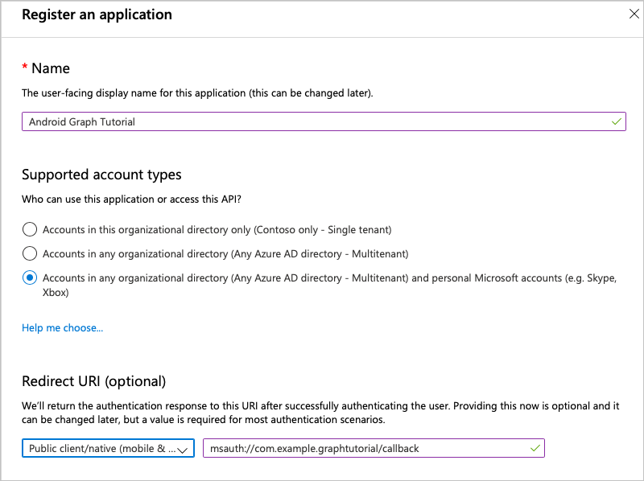
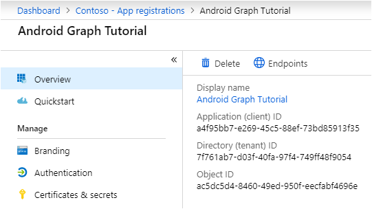

<!-- markdownlint-disable MD002 MD041 -->

In dieser Übung erstellen Sie eine neue Azure AD native-Anwendung mithilfe des Azure Active Directory Admin Center.

1. Öffnen Sie einen Browser, und navigieren Sie zum [Azure Active Directory Admin Center](https://aad.portal.azure.com). Melden Sie sich mit einem **persönlichen Konto** (auch: Microsoft-Konto) oder einem **Geschäfts- oder Schulkonto** an.

1. Wählen Sie in der linken Navigationsleiste **Azure Active Directory** aus, und wählen Sie dann **App-Registrierungen (Vorschau)** unter **Verwalten** aus.

    

1. Wählen Sie **Neue Registrierung** aus. Legen Sie auf der Seite **Anwendung registrieren** die Werte wie folgt fest.

    - Legen Sie **Name** auf `Android Graph Tutorial` fest.
    - Legen Sie **Unterstützte Kontotypen** auf **Konten in allen Organisationsverzeichnissen und persönliche Microsoft-Konten** fest.
    - Lassen Sie **URI umleiten** leer.

    

1. Wählen Sie **Registrieren** aus. Kopieren Sie auf der Seite mit dem **Android-Graph-Lernprogramm** den Wert der **Anwendungs-ID (Client)** , und speichern Sie ihn, dann benötigen Sie ihn im nächsten Schritt.

    

1. Wählen Sie den Link umLeitungs- **URI hinzufügen** aus. Suchen Sie auf der Seite **URIs umleiten** nach dem Abschnitt Empfohlene Umleitungs- **URIs für öffentliche Clients (Mobil, Desktop)** . Wählen Sie den URI aus, `msal` der mit beginnt, und kopieren Sie ihn, und wählen Sie dann **Speichern**aus. Speichern Sie den kopierten Umleitungs-URI, den Sie im nächsten Schritt benötigen.

    